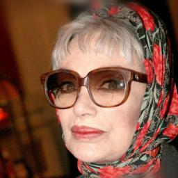
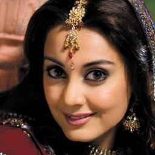
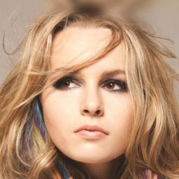
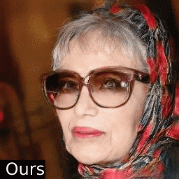
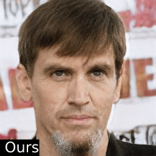
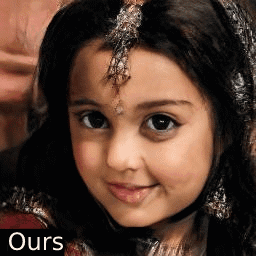
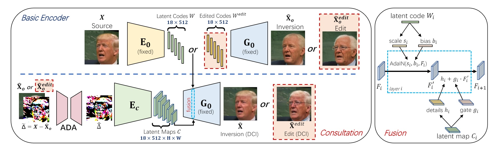
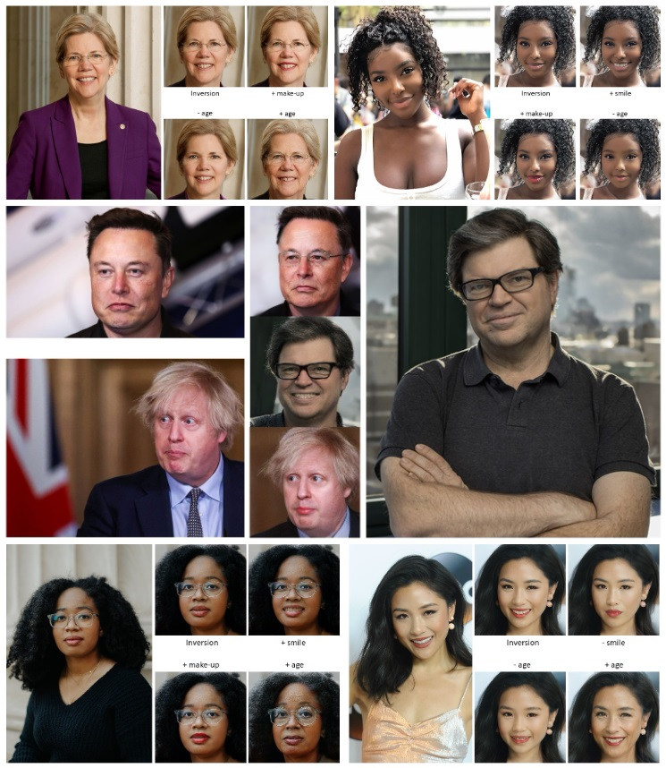

# HFGI: High-Fidelity GAN Inversion for Image Attribute Editing (CVPR 2022)

> High-Fidelity GAN Inversion for Image Attribute Editing   
> https://tengfei-wang.github.io/HFGI/

Update: We released the inference code and the pre-trained model on Oct. 31. The training code is coming soon.   
Update: We provided a Colab notebook for play.  
Update: We released the training code.

[paper](https://arxiv.org/pdf/2109.06590.pdf) | [supp.](https://github.com/Tengfei-Wang/Tengfei-Wang.github.io/blob/master/HFGI/supp.pdf) | [project website](https://tengfei-wang.github.io/HFGI/) | [demo video](https://www.youtube.com/watch?v=yfF9QdIsbvU) |
[Colab](http://colab.research.google.com/github/Tengfei-Wang/HFGI/blob/main/HFGI_playground.ipynb) | [online demo](https://replicate.ai/tengfei-wang/hfgi)
  
               

             


## Introduction
We present a novel high-fidelity GAN inversion framework that enables attribute editing with image-specific details well-preserved (e.g., background, appearance and illumination).

  

## To Do
- [x] Release the inference code
- [x] Release the pretrained model
- [x] Release the training code 
## Set up
### Installation
```
git clone https://github.com/Tengfei-Wang/HFGI.git
cd HFGI
```

### Environment
The environment can be simply set up by Anaconda (only tested for inference):
```
conda create -n HFGI python=3.7
conda activate HFGI
pip install torch==1.6.0+cu101 torchvision==0.7.0+cu101 -f https://download.pytorch.org/whl/torch_stable.html
pip install matplotlib
conda install ninja
conda install -c 3dhubs gcc-5
```

Or, you can also set up the environment from the provided `environment.yml`:
```
conda env create -f environment.yml
```

## Quick Start
### Pretrained Models
Please download our pre-trained model and put it in  `./checkpoint`.
| Model | Description
| :--- | :----------
|[Face Editing](https://drive.google.com/file/d/19y6pxOiJWB0NoG3fAZO9Eab66zkN9XIL/view?usp=sharing)  | Trained on FFHQ.

### Prepare Images
We put some images from CelebA-HQ in `./test_imgs`, and you can quickly try them (and other images from CelebA-HQ or FFHQ).   
For customized images, it is encouraged to first pre-process (align & crop) them, and then edit with our model. See [FFHQ](https://github.com/NVlabs/ffhq-dataset)
for alignment details.

### Inference
Modify `inference.sh` according to the follwing instructions, and run:   
(It is possibly slow for the first-time running.)
```
bash inference.sh
```

| Args | Description
| :--- | :----------
| --images_dir | the path of images.
| --n_sample | number of images that you want to infer.
| --edit_attribute | We provide options of 'inversion', 'age', 'smile', 'eyes', 'lip' and 'beard' in the script.
| --edit_degree | control the degree of editing (works for 'age' and 'smile').


## Training
### Preparation
1. Download datasets and modify the dataset path in `./configs/paths_config.py` accordingly.
2. Download some pretrained models and put them in `./pretrained`.

| Model | Description
| :--- | :----------
|[StyleGAN2 (FFHQ)](https://drive.google.com/file/d/1EM87UquaoQmk17Q8d5kYIAHqu0dkYqdT/view?usp=sharing) | Pretrained face generator on FFHQ  from [rosinality](https://github.com/rosinality/stylegan2-pytorch).
|[e4e (FFHQ)](https://drive.google.com/file/d/1cUv_reLE6k3604or78EranS7XzuVMWeO/view?usp=sharing) | Pretrained initial encoder on FFHQ  from [omertov](https://github.com/omertov/encoder4editing).
|[Feature extractor (for face)](https://drive.google.com/file/d/1KW7bjndL3QG3sxBbZxreGHigcCCpsDgn/view?usp=sharing) | Pretrained IR-SE50 model taken from [TreB1eN](https://github.com/TreB1eN/InsightFace_Pytorch) for ID loss calculation.
|[Feature extractor (for car)](https://drive.google.com/file/d/18rLcNGdteX5LwT7sv_F7HWr12HpVEzVe/view?usp=sharing) | Pretrained ResNet-50 model taken from [omertov](https://github.com/omertov/encoder4editing) for ID loss calculation.


### Start Training
Modify `option` and `training.sh` and run:
```
bash train.sh
```
## Video Editing
The source videos and edited results in our paper can be found in [this link](https://drive.google.com/drive/folders/1h3swFCV9mEAsz3qIRlyVQynaxSQeH7II?usp=sharing).   
For video editing, we first pre-process (align & crop) each frame, and then perform editing with the pre-trained model.

## More Results
  

## Citation
If you find this work useful for your research, please cite:

``` 
@inproceedings{wang2021HFGI,
  title={High-Fidelity GAN Inversion for Image Attribute Editing},
  author={Wang, Tengfei and Zhang, Yong and Fan, Yanbo and Wang, Jue and Chen, Qifeng},
  booktitle = {Proceedings of the IEEE/CVF Conference on Computer Vision and Pattern Recognition (CVPR)},
  year={2022}
}
```

## Acknowledgement
Thanks to [omertov](https://github.com/omertov/encoder4editing) for sharing their code.
