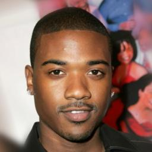
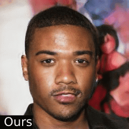
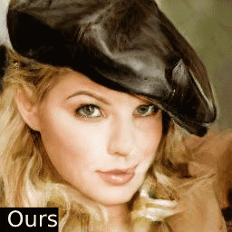
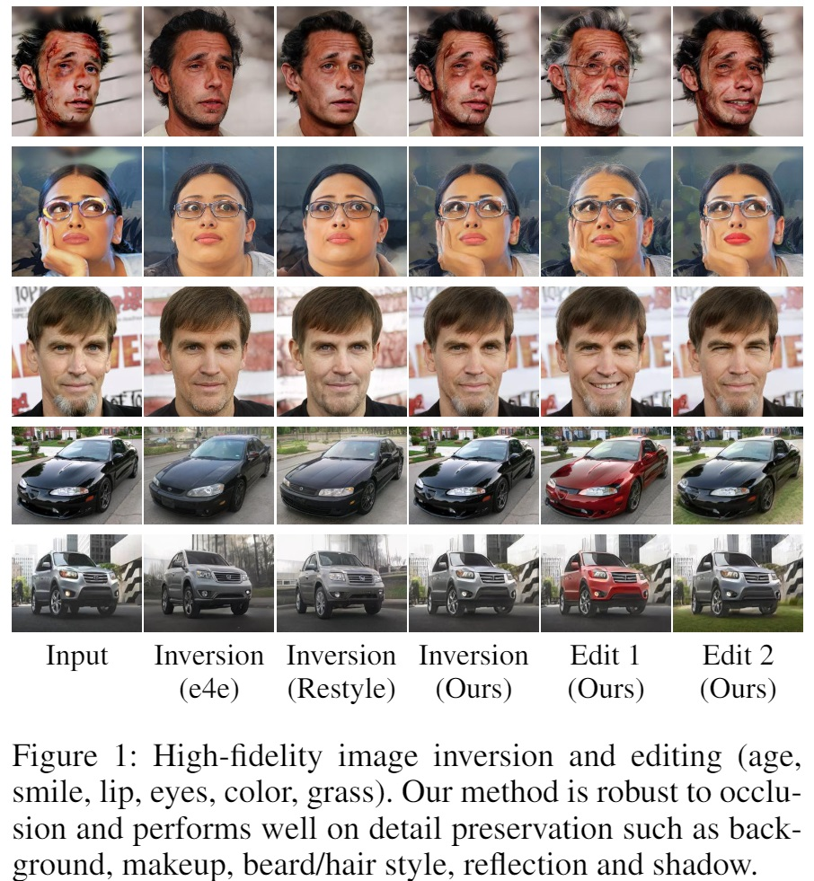
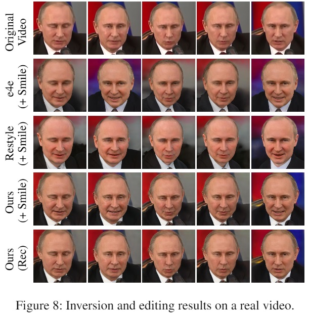

# HFGI: High-Fidelity GAN Inversion for Image Attribute Editing

> High-Fidelity GAN Inversion for Image Attribute Editing   

Update: We released the inference code and the pre-trained model on Oct. 31. The training code is coming soon.

[paper](https://arxiv.org/pdf/2109.06590.pdf) | [project website](https://tengfei-wang.github.io/HFGI/) | [demo video](https://www.youtube.com/watch?v=_CXk4LjoKP8)

                  

                   


## Introduction
We present a novel high-fidelity GAN inversion framework that enables attribute editing with image-specific details well-preserved (e.g., background, appearance and illumination).

  

## To Do
- [x] Release the inference code
- [x] Release the pretrained model
- [ ] Release the training code (upon approval)

## Set up
### Installation
```
git clone https://github.com/Tengfei-Wang/HFGI.git
cd HFGI
```

### Environment
The environment can be simply set up by Anaconda (only tested for inference):
```
conda create -n HFGI python=3.7
conda activate HFGI
pip install torch==1.6.0+cu101 torchvision==0.7.0+cu101 -f https://download.pytorch.org/whl/torch_stable.html
pip install matplotlib
conda install ninja
conda install -c 3dhubs gcc-5
```

Or, you can also set up the environment from the provided `environment.yml`:
```
conda env create -f environment.yml
```

## Quick Start
### Pretrained Models
Please download our pre-trained model and put it in  `./checkpoint`.
| Model | Description
| :--- | :----------
|[Face Editing](https://drive.google.com/file/d/19y6pxOiJWB0NoG3fAZO9Eab66zkN9XIL/view?usp=sharing)  | Trained on FFHQ.

### Prepare Images
We put some images from CelebA-HQ in `./test_imgs`, and you can quickly try them (and other images from CelebA-HQ or FFHQ).   
For customized images, it is encouraged to first pre-process (align & crop) them, and then edit with our model. See [FFHQ](https://github.com/NVlabs/ffhq-dataset)
for alignment details.

### Inference
Modify `inference.sh` according to the follwing instructions, and run:
```
bash inference.sh
```

| Args | Description
| :--- | :----------
| --images_dir | the path of images.
| --n_sample | number of images that you want to infer.
| --edit_attribute | We provide options of 'inversion', 'age', 'smile', 'eyes', 'lip' and 'beard' in the script.
| --edit_degree | control the degree of editing (works for 'age' and 'smile').


## Training
Coming soon

## Video Editing
The source videos and edited results in our paper can be found in [this link](https://drive.google.com/drive/folders/1h3swFCV9mEAsz3qIRlyVQynaxSQeH7II?usp=sharing).   
For video editing, we first pre-process (align & crop) each frame, and then perform editing with the pre-trained model.

## More Results
     

## Citation
If you find this work useful for your research, please cite:

``` 
@article{wang2021HFGI,
      author = {Tengfei Wang and Yong Zhang and Yanbo Fan and Jue Wang and Qifeng Chen},
      title = {High-Fidelity GAN Inversion for Image Attribute Editing}, 
      journal = {arxiv:2109.06590},  
      year = {2021}
}
```
